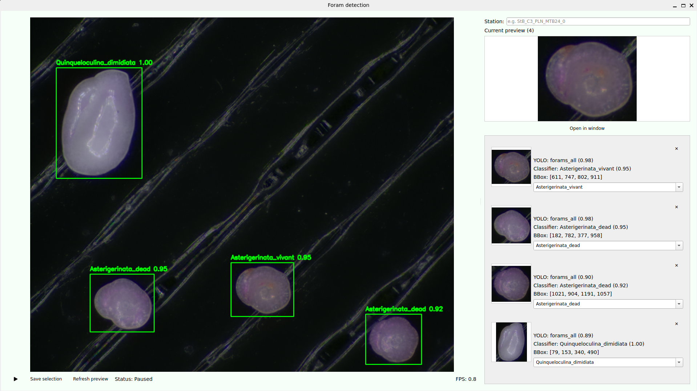

#   Foram Detection & Classification Tool



##   Overview

This project provides a complete pipeline to:

- Detect foraminifera using **YOLO**
- Classify detected objects using a **custom ONNX model**
- Visualize results in a **Qt (PySide6) interface**
- Manually review and clean detections
- Build a **clean classification dataset** interactively

The application is designed to work with:
- image folders
- video files
- live camera streams such as a USB microscope

---

##   Features

### Detection
- YOLO-based object detection
- Bounding boxes and confidence display

### Classification
- ONNX model inference on cropped detections
- Batch processing for better performance

### Interactive UI
- Live video or image display
- Right-side preview panel
- Click a crop to enlarge it
- Open crop in a separate window

### Manual Review
- Edit predicted species via dropdown
- Remove bad crops with a cross button
- Avoid polluting the dataset with low-quality detections

### Dataset Builder
- Save only validated crops
- Automatic folder structure:

```text
dataset/
├── Species_A/
│   ├── Species_A-Station-1.png
│   ├── Species_A-Station-2.png
├── Species_B/
```

- Unique naming with auto-incremented IDs

---

##   Project Structure

```text
sources/
├── main.py
├── windowUI.py
├── detector.py
├── classifier.py
├── video_sources.py
```

---

##   Installation with Conda

### 1. Create the environment

```bash
conda create -n foram python=3.10 -y
conda activate foram
```

### 2. Install dependencies

```bash
pip install -r requirements.txt
```

---

##   Running the Application

From the `sources/` directory:

```bash
python main.py
```

---

##   Input Sources

In `main.py`, choose your source:

### Image folder
```python
base_source = ImageFolderSource("../data/images", interval_seconds=3.0)
```

### Video file
```python
base_source = FileVideoSource("../data/testvideo.mp4", loop=True)
```

### Webcam / USB microscope
```python
base_source = OpenCVVideoSource(0)
```

---

##   How It Works

Pipeline:

```text
Frame -> YOLO Detection -> Crop -> Classification -> UI Display -> Manual Review -> Save Dataset
```

---

##   Workflow

1. Load images or video
2. Review detections in the preview panel
3. Remove bad crops with the cross button
4. Adjust species labels if needed
5. Enter the station name
6. Click **Save selection**

---

##   Output Dataset

Each saved crop is stored in a species folder with the following format:

```text
SpeciesName-StationName-ID.png
```

Example:

```text
Adelosina_spp-StB_C3_PLN_MTB24_0-1.png
```

---

##   Notes for Raspberry Pi

- The UI and pipeline are portable to Raspberry Pi
- Real-time performance will depend on:
  - YOLO model size
  - ONNX model complexity
  - camera source
  - Raspberry Pi model

Recommended optimizations:
- Process one frame every N frames
- Use smaller models
- Lower the camera resolution when needed

---

##   Camera Support

Depending on the hardware:

### Case 1
The camera is recognized as `/dev/video0` and works directly with OpenCV.

### Case 2
The camera requires a vendor SDK. In that case, a custom `VideoSource` class can be added without changing the rest of the pipeline.

---

##   Purpose

This tool is designed to:
- accelerate dataset creation
- reduce manual labeling effort
- improve classification model quality
